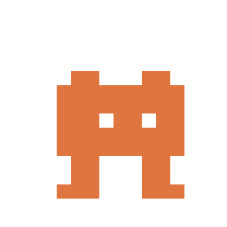
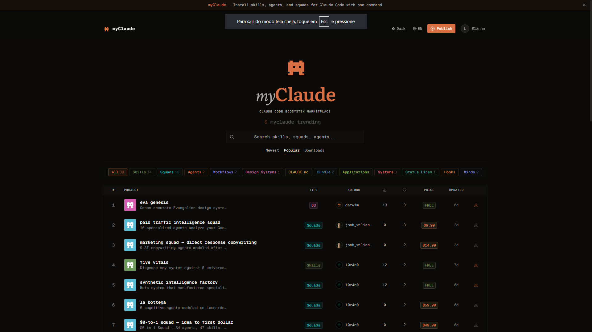

<!--
@name: MyClaude Studio Engine
@version: 3.0.0
@lang: pt-BR
-->

<p align="center">
  
</p>

<h1 align="center">MyClaude Studio Engine</h1>

<p align="center">
  <strong>O pipeline de criacao para produtos Claude Code.</strong><br>
  <sub>Pesquise o que construir. Crie com estrutura. Valide qualidade. Publique em um marketplace.<br>Um engine. Qualquer expertise. Sem precisar programar.</sub>
</p>

<p align="center">
  <a href="https://github.com/myclaude-sh/myclaude-creator-engine/releases"></a>
  <a href="https://myclaude.sh"></a>
  <a href="#qualidade-mensuravel"></a>
  <a href="LICENSE"></a>
</p>

<p align="center">
  <a href="#instale-em-30-segundos">Instalar</a> ·
  <a href="#veja-em-acao">Exemplo</a> ·
  <a href="#o-que-voce-pode-criar">Criar</a> ·
  <a href="docs/getting-started.md">Guias</a> ·
  <a href="https://myclaude.sh">Marketplace</a> ·
  <a href="docs/faq.md">FAQ</a> ·
  <a href="README.md">English</a>
</p>

---

Milhares de usuarios de Claude Code constroem skills, agents e ferramentas customizadas todos os dias.
Mas nao existe padrao de qualidade — nenhuma forma de saber se o que voce construiu e robusto, nenhum processo guiado a seguir, e nenhuma forma simples de compartilhar seu trabalho.

**O Studio Engine e o pipeline de criacao que faltava.**
Ele te guia da ideia ao produto publicado: pesquisando seu dominio, gerando estrutura, guiando voce pelo conteudo, pontuando qualidade contra 20 padroes estruturais, e publicando em um [marketplace](https://myclaude.sh) onde qualquer pessoa instala seu trabalho com um comando.

Voce nao precisa programar. Voce precisa de expertise que vale compartilhar.

<p align="center">
  <br>
  
  <br>
  <sub>O <a href="https://myclaude.sh">myClaude Marketplace</a> — onde seus produtos vivem.</sub>
</p>

---

## Instale em 30 Segundos

```bash
myclaude studio
```

> Nao tem a CLI? `npm i -g @myclaude-cli/cli` — depois rode o comando acima.
>
> Ou clone: `git clone https://github.com/myclaude-sh/myclaude-creator-engine && cd myclaude-creator-engine && claude`

Pronto. Abra a pasta no Claude Code e rode `/onboard` — o engine se adapta a voce.

---

## Veja em Acao

Um consultor de seguranca Kubernetes usou o engine para transformar 15 anos de expertise em um advisor instalavel — em uma sessao:

```
/scout kubernetes-security
```
> O engine testou o que o Claude ja sabe sobre seguranca K8s, encontrou 11 gaps
> que ele nao cobre sozinho, escaneou o marketplace, e recomendou
> construir um cognitive mind.

```
/create minds
```
> Gerou a estrutura do produto com anotacoes guiadas — 7 secoes,
> cada uma com contexto sobre o que pertence ali e por que.

```
/fill
```
> O engine fez perguntas direcionadas: "Qual a primeira coisa que voce
> verifica em uma auditoria de cluster?" "Me guie por um caminho de ataque
> a partir de um etcd exposto." O consultor respondeu. O engine escreveu.

```
/validate
```
> Pontuacao 100% — qualidade Elite. 20/20 padroes estruturais passando.
> Raciocinio de attack-path, benchmarks CIS, checklists de hardening — verificado.

```
/publish
```
> Ao vivo no myclaude.sh. Qualquer pessoa no mundo pode rodar:
> `myclaude install k8s-security-advisor`
> e o Claude Code ganha expertise profunda em seguranca K8s que nao tem nativamente.

**O consultor forneceu a expertise. O engine cuidou de todo o resto.**

> ✦ Essa e a tese: Claude e poderoso de fabrica. Mas o *seu* Claude — aumentado com expertise real — e outra coisa.

---

## O Que Voce Pode Criar

| Voce e... | Voce cria... | Comece com |
|:--|:--|:--|
| **Desenvolvedor** | Skills, agents, hooks, squads multi-agente | `/create skill` |
| **Consultor / Coach** | Frameworks de metodologia que qualquer um pode instalar | `/create workflow` |
| **Especialista** | Advisors de conhecimento com raciocinio profundo | `/create minds` |
| **Lider de equipe** | Times multi-agente com padroes de qualidade | `/create squad` |
| **Escritor / Pesquisador** | Ferramentas que ampliam as capacidades do Claude | `/scout seu-dominio` |
| **Qualquer pessoa com expertise** | O que o Claude Code nao faz sozinho | `/scout` depois `/create` |

Cada produto e **autocontido** — sem dependencia do engine apos instalacao. Portatil, seu, para sempre.

> **Veja mais cenarios:** [Casos de Uso](docs/use-cases.md) — advogados, marketeiros, consultores, solo businesses, pesquisadores.

> **Nao sabe o que construir?** Rode `/scout marketing-strategy` (ou qualquer dominio). O engine testa o que o Claude ja sabe, encontra os gaps, e recomenda exatamente o que construir.

---

## Como Funciona

```
  pesquisar      criar       refinar      verificar     publicar
  /scout    →   /create  →   /fill   →  /validate →   /publish
                   │                        │
                   │   preenchimento guiado  │  20 padroes
                   │   com sua expertise     │  de qualidade
                   └────────────────────────┘
```

O engine faz as perguntas certas. Voce fornece a expertise. Cada passo alimenta o proximo — a pesquisa do scout flui para `/create`, que gera estrutura para `/fill`, que produz conteudo pontuado pelo `/validate`. Nada e desconectado.

<details>
<summary><strong>Todos os 15 comandos</strong></summary>
<br>

| Fase | Comando | O Que Faz |
|:------|:--------|:-------------|
| **Perfil** | `/onboard` | Configura seu perfil — o engine se adapta a voce |
| **Pesquisa** | `/scout [dominio]` | Testa conhecimento do Claude, encontra gaps, escaneia competicao |
| **Conhecimento** | `/map [topico]` | Extrai e estrutura sua expertise em um mapa reutilizavel |
| **Criar** | `/create [tipo]` | Gera produto com DNA estrutural e anotacoes guiadas |
| **Preencher** | `/fill` | Preenchimento guiado — o engine pergunta, voce responde, ele escreve |
| **Qualidade** | `/validate` | Pontua contra 20 padroes (Verificado / Premium / Elite) |
| **Testar** | `/test` | Validacao comportamental em sandbox isolado — 3 cenarios |
| **Empacotar** | `/package` | Remove anotacoes, gera manifestos, prepara distribuicao |
| **Publicar** | `/publish` | Publica no [myclaude.sh](https://myclaude.sh) com um comando |
| **Importar** | `/import` | Traz skills existentes para o pipeline de validacao |
| **Status** | `/status` | Dashboard — pontuacoes, proximos passos, visao do portfolio |
| **Ajuda** | `/help` | Referencia com recomendacoes personalizadas |
| **Pensar** | `/think` | Brainstorm e compare abordagens antes de decidir |
| **Explorar** | `/explore` | Busque no marketplace por ferramentas e inspiracao |
| **Seguranca** | `/aegis` | Auditoria de seguranca para qualquer codebase |

</details>

---

## O Que Torna Diferente

Outras ferramentas no ecossistema Claude Code oferecem **configuracoes prontas** — colecoes de skills, agents e regras para instalar. Sao armazens de pecas prontas.

O Studio Engine e uma **fabrica**. Ele ajuda voce a criar as suas.

| | Ferramentas de config pronta | Studio Engine |
|---|---|---|
| **O que voce recebe** | Skills de outra pessoa | Seus proprios produtos |
| **Qualidade** | Confie no autor | Pontuado contra 20 padroes |
| **Processo** | Copie e instale | Pesquise → crie → valide → publique |
| **Publico** | So desenvolvedores | Qualquer pessoa com expertise |
| **Distribuicao** | Repo no GitHub | Marketplace com install em um comando |
| **Apos instalar** | Depende do repo | Autocontido, zero dependencia |

**Nenhuma outra ferramenta no ecossistema valida qualidade antes de publicar.** O sistema MCS e unico — seus produtos sao verificados, nao apenas funcionais.

---

## Qualidade Mensuravel

Formula: `(DNA x 0.50) + (Estrutural x 0.30) + (Integridade x 0.20)`

| Tier | Pontuacao | Significado |
|:-----|:----------|:-----------|
| **Verificado** | >= 75% | Funcional, documentado, padroes basicos presentes |
| **Premium** | >= 85% | Qualidade profissional — padroes estruturais avancados |
| **Elite** | >= 92% | Estado-da-arte — qualidade estrutural profunda |

20 padroes verificam: protocolos de ativacao, tratamento de erros, guards anti-padrao, progressive disclosure, quality gates, degradacao graciosa, design cache-friendly, e mais.

Rode `/validate` a qualquer momento. O engine mostra exatamente o que passa, o que precisa de trabalho, e como corrigir — com instrucoes especificas, nao sugestoes vagas.

---

## O Ecossistema

```
         VOCE                        QUALQUER PESSOA
          │                             │
     ┌────┴────┐                   ┌────┴────┐
     │  CRIE   │                   │ INSTALE  │
     │ Engine  │  ──── publish ──→ │   CLI    │
     │ /create │                   │ myclaude │
     │ /fill   │                   │ install  │
     │/validate│                   │          │
     └─────────┘                   └──────────┘
          │                             │
          └──── myclaude.sh ────────────┘
                marketplace
```

| Componente | O Que E | Link |
|:-----------|:--------|:-----|
| **Engine** (este repo) | Crie e valide produtos | MIT, open source |
| **CLI** (`@myclaude-cli/cli`) | Busque, instale, publique pelo terminal | [myclaude.sh](https://myclaude.sh) |
| **Marketplace** | Navegue e instale com um comando | [myclaude.sh](https://myclaude.sh) |

Produtos criados pelo engine usam o **formato Agent Skills** — YAML frontmatter com nome, descricao e restricoes, seguido de instrucoes em markdown. E o mesmo formato `SKILL.md` usado nativamente pelo Claude Code e reconhecido por outras ferramentas de IA que suportam definicoes estruturadas de skills.

---

<details>
<summary><h2>13 Tipos de Produto</h2></summary>
<br>

Cada tipo tem DNA estrutural especifico — padroes que garantem funcionamento, tratamento de edge cases e ativacao confiavel.

| Tipo | O Que E | Ideal Para |
|:-----|:--------|:-----------|
| **skill** | Ferramenta de proposito unico | Review, docs, auditorias, analises |
| **agent** | Executor autonomo multi-passo | Automacao complexa com tomada de decisao |
| **squad** | Time multi-agente com roteamento | Tarefas multi-dominio coordenadas |
| **workflow** | Automacao de processo orquestrado | Processos e metodologias padronizadas |
| **minds** | Advisor especialista (advisory ou cognitive) | Conhecimento profundo como inteligencia instalavel |
| **system** | Ferramenta multi-componente | Quando uma skill nao basta |
| **claude-md** | Regras comportamentais e padroes | Padroes de equipe, criterios de review |
| **hooks** | Automacao de ciclo de vida | Acoes em eventos do Claude Code |
| **statusline** | Widgets de status no terminal | Informacao customizada na barra |
| **output-style** | Regras de formatacao | Como o Claude estrutura respostas |
| **design-system** | Sistemas de design tokens | Linguagem visual entre projetos |
| **application** | Aplicacoes standalone | Ferramentas completas |
| **bundle** | Meta-pacotes | Suites instalaveis por dominio |

</details>

---

## Publicados no Marketplace

Produtos criados com o Studio Engine e publicados no [myclaude.sh](https://myclaude.sh):

| Produto | Tipo | O Que Faz |
|:--------|:-----|:----------|
| K8s Security Advisor | minds | Expertise profunda em seguranca Kubernetes — attack paths, CIS, hardening |
| AEGIS Security Auditor | skill | STRIDE threat modeling, 300+ padroes de vulnerabilidade, 8 frameworks |
| Noctis Terminal Themes | system | Engine de temas de terminal — 5 skills, 8 exports |
| Context Surgeon | skill | Otimizacao precisa de context window para Claude Code |
| BSI Shopping Intelligence | skill | Inteligencia de compra com matrizes comparativas |

> Navegue todos os 39 produtos em [myclaude.sh](https://myclaude.sh), ou rode `/explore` dentro do engine.

---

## Documentacao

| Guia | Publico | Tipo |
|:-----|:--------|:-----|
| **[Casos de Uso](docs/use-cases.md)** | Todos | Cenarios — advogados, marketeiros, consultores, solo businesses |
| **[Primeiros Passos](docs/getting-started.md)** | Todos | Tutorial — crie seu primeiro produto |
| **[Para Desenvolvedores](docs/guides/for-developers.md)** | Desenvolvedores | How-to — skills, agents, hooks, squads |
| **[Para Especialistas](docs/guides/for-domain-experts.md)** | Nao-devs | How-to — empacote conhecimento |
| **[Para Times](docs/guides/for-teams.md)** | Lideres | How-to — workflows e squads |
| **[Comandos](docs/reference/commands.md)** | Todos | Referencia — 15 comandos |
| **[Tipos de Produto](docs/reference/product-types.md)** | Todos | Referencia — 13 tipos |
| **[Sistema de Qualidade](docs/reference/quality-system.md)** | Todos | Referencia — pontuacao e padroes |
| **[Arquitetura](docs/reference/architecture.md)** | Desenvolvedores | Referencia — como Engine, CLI, Marketplace e CC conectam |
| **[FAQ](docs/faq.md)** | Todos | Perguntas frequentes |
| **[Guia de Instalacao](docs/install-guide.md)** | Todos | Opcoes detalhadas de instalacao |
| **[Changelog](CHANGELOG.md)** | Todos | Historico de versoes — v1.0 ate v3.0.0 |

---

## Requisitos

- **[Claude Code](https://claude.ai/download)** — CLI, desktop ou extensao IDE
- **[MyClaude CLI](https://myclaude.sh)** — para publicar e acessar o marketplace (`npm i -g @myclaude-cli/cli`)

---

## Contribuindo

O engine melhora com uso. Se algo parece errado — friccao, confusao, uma feature faltando — isso e sinal valioso.

**Contribuicoes sao bem-vindas.** Veja [CONTRIBUTING.md](CONTRIBUTING.md).

Formas de contribuir:
- **Relatos de friccao** de uso real — a contribuicao mais valiosa
- **Novos tipos de produto** com spec DNA, template e exemplar
- **Novos padroes estruturais** com logica de validacao
- **Melhorias na documentacao** e traducoes
- **Bug fixes** e melhorias de qualidade

---

## Licenca

MIT. Veja [LICENSE](LICENSE).

---

## Por Que Isso Existe

Todo usuario de Claude Code tem um setup. Skills refinadas. Workflows repetidos. Conhecimento codificado em prompts e regras ao longo de semanas de trabalho real. Esse setup te torna poderoso.

Mas ele esta preso. Na sua maquina, no seu projeto, na sua cabeca. Voce nao consegue pontuar. Nao consegue compartilhar. Nao consegue instalar em outro lugar com um comando. E a pessoa ao lado — o consultor, o pesquisador, o dev do outro lado do mundo — esta resolvendo o mesmo problema do zero porque a sua solucao e invisivel pra ela.

O Studio Engine existe pra mudar essa equacao. Pra tornar todo setup de Claude Code compartilhavel, toda expertise instalavel, toda ferramenta pontuavel antes de publicar. Nao como uma plataforma dona do seu trabalho — como um pipeline que empacota e sai do caminho.

A visao e simples: um mundo onde o Claude Code fica melhor toda vez que alguem publica um produto. Onde a metodologia de revisao de contratos de uma advogada vira uma ferramenta que qualquer advogado instala. Onde o playbook operacional de um solo founder vira um bundle que economiza 10 horas por semana pro proximo. Onde qualidade nao e achismo — e um numero.

Cada feature veio de uma necessidade real. O scoring existe porque publicar sem saber se esta solido nao e publicar — e torcer. O pipeline guiado existe porque um arquivo em branco e onde boas ideias vao pra morrer. O suporte a nao-devs existe porque a expertise mais profunda nao vem de quem escreve codigo — vem de quem resolve problemas reais todo dia e nunca teve como empacotar isso.

Isso foi construido por um usuario de Claude Code, com Claude Code, para usuarios de Claude Code. O engine inteiro foi criado usando o mesmo pipeline que ele te ensina a usar. Dogfooding nao e buzzword aqui — e a arquitetura.

**O marketplace e o multiplicador.** Cada produto publicado torna o ecossistema mais inteligente. Cada install torna o Claude Code de alguem mais capaz. Cada criador que empacota sua expertise eleva o piso pra todo mundo. Esse e o jogo.

O nome diz tudo. **myClaude** — nao *o* Claude, nao *um* Claude. *O seu.* No momento que voce instala um produto que carrega a expertise real de alguem, o Claude para de ser uma IA generica e se torna algo pessoal. Moldado pelo que voce precisa. Aumentado pelo que outros sabem. Essa e a tese: Claude e poderoso de fabrica, mas o *seu* Claude — configurado, especializado, estendido com ferramentas construidas por quem entende o seu dominio — isso e outra coisa.

---

## Reconhecimentos

Este e um projeto independente, movido pela comunidade. **Nao e afiliado nem endossado pela Anthropic.** O engine cria produtos que funcionam com o [Claude Code](https://claude.ai/download) — ferramenta oficial da Anthropic — mas nao e feito pela Anthropic.

Construido com respeito pelo ecossistema e pelos desenvolvedores, pesquisadores, consultores e criadores que empurram o Claude Code adiante todos os dias.

---

<p align="center">
  <sub>Todo usuario de Claude Code merece operar no apice do que a ferramenta pode fazer.<br>Alguns criam ferramentas, alguns instalam, a maioria faz os dois. O marketplace e a ponte.</sub>
</p>

<p align="center">
  <a href="https://myclaude.sh">myclaude.sh</a>
</p>
